# FILO2
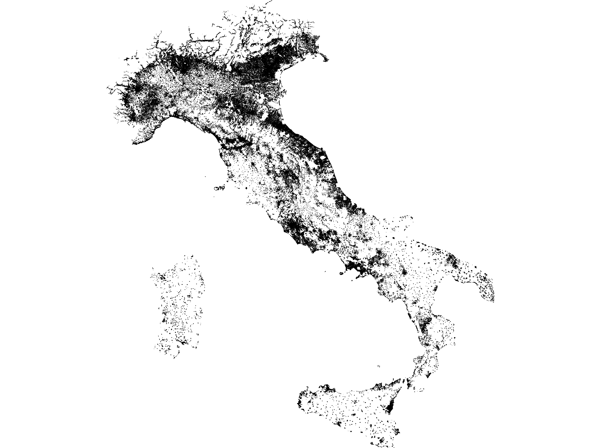
FILO2 is an evolution of [FILO](https://github.com/acco93/filo) able to tackle much larger CVRP instances with a very ordinary computing system. 
Less than ten minutes and 10GB of RAM are enough to execute 100k FILO2 iterations and get a (possibly very bad) solution for an instance with 1 million customers. 
On the [X](instances/X/) and [B](instances/B/) datasets FILO2 behaves pretty much like FILO in terms of quality (sometimes it is even slightly better) but it has a considerably lower time growth rate that becomes very visible for instances with more than 5k customers.

Changes and computational results are described in the [draft](https://arxiv.org/abs/2306.14205) and in the [paper](https://www.sciencedirect.com/science/article/pii/S0305054824000340). This repository contains [raw results](results/) and the algorithm source code.

### Updates
The code has received some updates related to implementation details 
- Mar 11, 2024 - [Commit 42276b7](https://github.com/acco93/filo2/commit/42276b76ded03a2cabd82206bf56b44fde299605): use faster rounding procedure
- Mar 13, 2024 - [Commit 2127972](https://github.com/acco93/filo2/commit/2127972f5d1e4a6d7abd8a41501908ef11a51b8a): use a more efficient set implementation in ruin&recreate and local search procedures
- Nov 24, 2024 - [Commit 292c3c1](https://github.com/acco93/filo2/commit/292c3c13b497f98ad9cb581e17ba3baa9cdc7277): simplify move generator class. The algorithm ìs ≈27% faster (on short runs) and uses ≈7% less memory

### Get the code
```
git clone git@github.com:acco93/filo2.git
```
Note that the repo includes ≈1.5GB of result files.

### Build & run
```
cd filo2
mkdir build
cd build
cmake .. -DCMAKE_BUILD_TYPE=Release -DENABLE_VERBOSE=1
make -j

./filo2 ../instances/I/Lazio.vrp
```

#### Compile time cmake options

- ENABLE_VERBOSE: prints info while processing
- ENABLE_GUI: shows a graphical representation (slows down thing a little)


### The I dataset ... in pictures
- [Valle d'Aosta](https://en.wikipedia.org/wiki/Aosta_Valley) (20k)

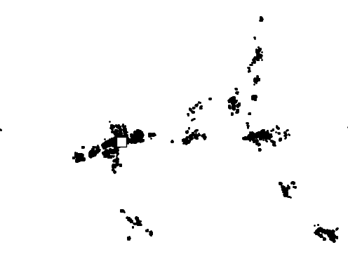

- [Molise](https://en.wikipedia.org/wiki/Molise) (50k)

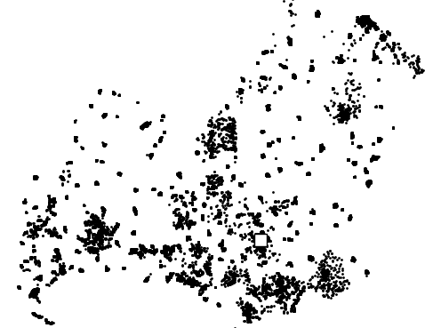

- [Trentino-Alto Adige](https://en.wikipedia.org/wiki/Trentino-Alto_Adige/S%C3%BCdtirol) (100k)

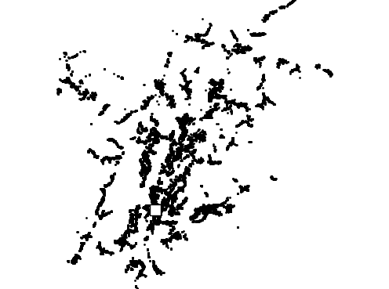

- [Basilicata](https://en.wikipedia.org/wiki/Basilicata) (150k)

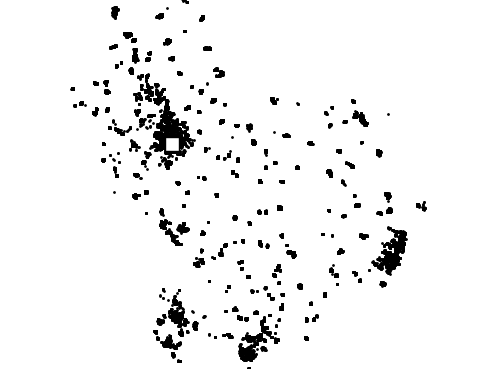

- [Umbria](https://en.wikipedia.org/wiki/Umbria) (200k)

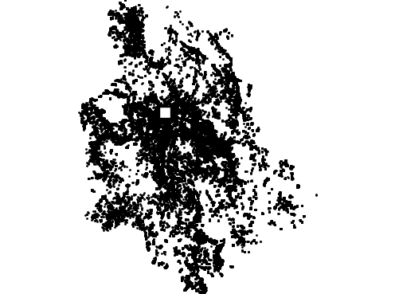

- [Abruzzo](https://en.wikipedia.org/wiki/Abruzzo) (250k)

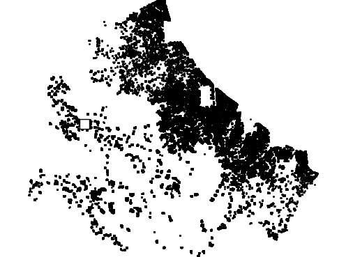

- [Friuli-Venezia Giulia](https://en.wikipedia.org/wiki/Friuli-Venezia_Giulia) (300k)

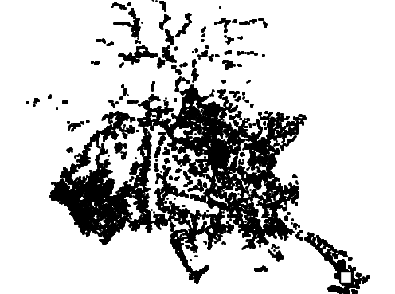

- [Liguria](https://en.wikipedia.org/wiki/Liguria) (320k)

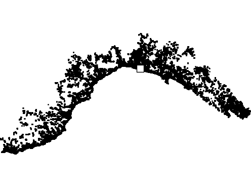

- [Calabria](https://en.wikipedia.org/wiki/Calabria) (380k)

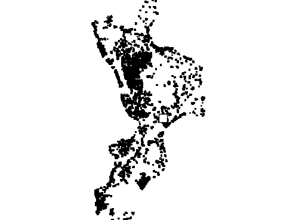

- [Marche](https://en.wikipedia.org/wiki/Marche) (420k)


- [Sardegna](https://en.wikipedia.org/wiki/Sardinia) (470k)

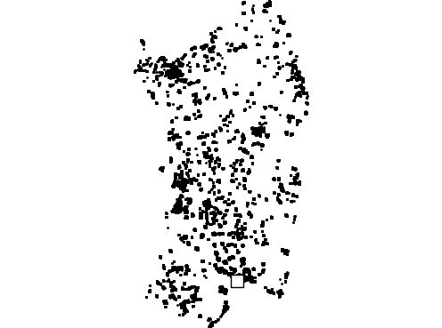

- [Campania](https://en.wikipedia.org/wiki/Campania) (500k)

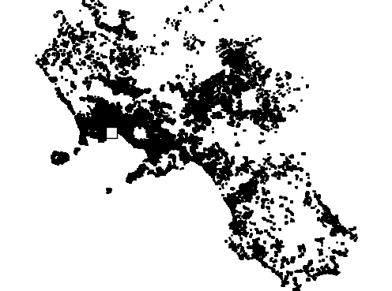

- [Piemonte](https://en.wikipedia.org/wiki/Piedmont) (600k)

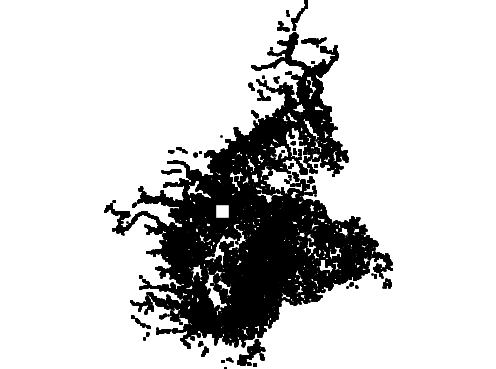

- [Toscana](https://en.wikipedia.org/wiki/Tuscany) (700k)

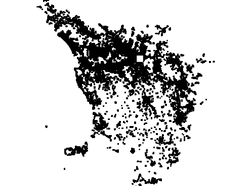

- [Puglia](https://en.wikipedia.org/wiki/Apulia) (750k)

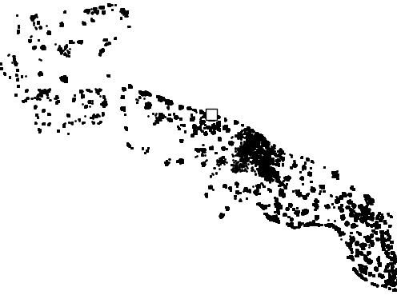

- [Sicilia](https://en.wikipedia.org/wiki/Sicily) (800k)

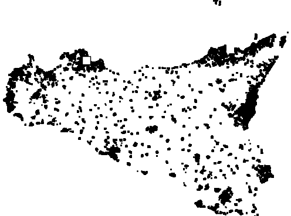

- [Veneto](https://en.wikipedia.org/wiki/Veneto) (850k)

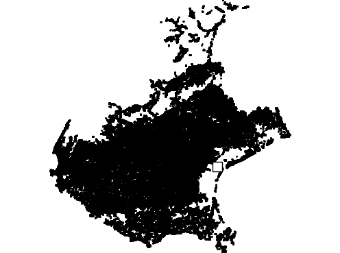

- [Emilia-Romagna](https://en.wikipedia.org/wiki/Emilia-Romagna) (900k)

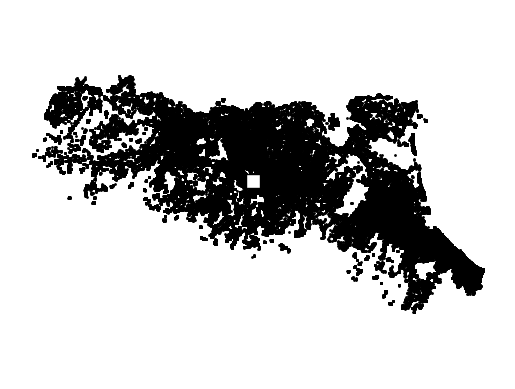

- [Lombardia](https://en.wikipedia.org/wiki/Lombardy) (950k)


- [Lazio](https://en.wikipedia.org/wiki/Lazio) (1M)

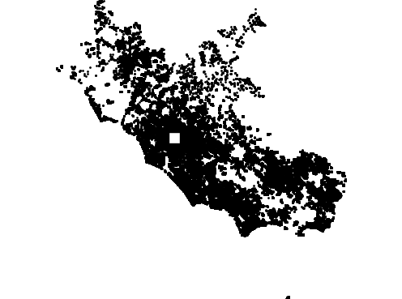